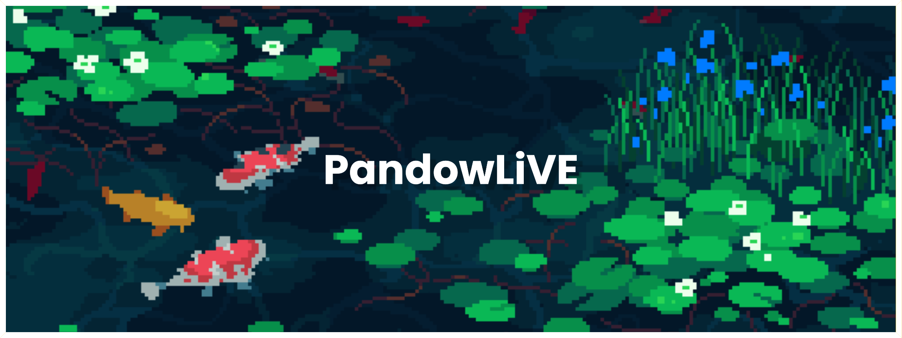

<p align="center"><a href="https://pandowlive.github.io">
  
</a></p>

<br />

I'm a self-taught DevOps from France  🇫🇷

**About me**

- 💼 Curently student near Lille, France

- 📈 Built multiple personnal projects across the years 

- ❤️ I love networking stuff

- 💬 Ask me about anything [here](https://github.com/pandowlive/pandowlive/issues)  

<a href="https://github.com/pandowlive/github-readme-stats">
  
</a>

<br />

```python
1. print("hello world")
2.

Error on line 2
```

<!-- <a href="https://github.com/pandowlive/convoychat">
  
</a>
<a href="https://github.com/pandowlive/github-readme-stats">
  
</a>
<a href="https://github.com/pandowlive/convoychat">
  
</a> 
